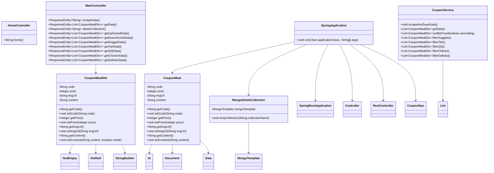

# pd2_final
```
pd2_final
├─ .gitignore
├─ .gitattributes
├─ .mvn
│  └─ wrapper
│     └─ maven-wrapper.properties
├─ mvnw
├─ mvnw.cmd
├─ pom.xml
├─ other
│  └─ meals.csv
└─ src
   ├─ main
   │  ├─ java
   │  │  └─ com
   │  │     └─ kfccoupon
   │  │        └─ pd2
   │  │           ├─ controller
   │  │           │  ├─ HomeController.java
   │  │           │  └─ HomeController.java
   │  │           ├─ dao
   │  │           │  ├─ CouponDao.java
   │  │           │  └─ MongoDeleteCollection.java
   │  │           ├─ dto
   │  │           │  └─ CouponMealDto.java
   │  │           ├─ model
   │  │           │  └─ CouponMeal.java
   │  │           ├─ service
   │  │           │  ├─ CouponService.java
   │  │           │  └─ Crawler.java
   │  │           └─ Pd2Application.java
   │  └─ resources
   │     ├─ application.properties
   │     ├─ static
   │     │  ├─ script.js
   │     │  └─ styles.css
   │     └─ templates
   │        └─ home.html
   └─ test
      └─ java
         └─ com
            └─ kfccoupon
               └─ pd2
                  └─ Pd2ApplicationTests.java
```

